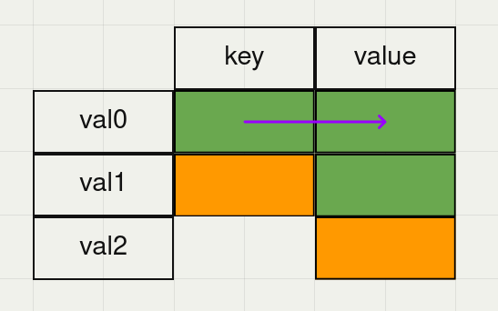

# Master Outline

## Abstract

## Acknowledgements


## Introduction

### Background

### Motivation

### Contribution


## Upgrading Boogie

### State before

### Methodology

### Changes

#### Normal changes

#### SMT change

#### CLI change

## Why did we choose Boogie Maps

## Support Boogie Maps


### Semantics of Boogie Maps [Early Notes]

[TODO ref Boogie manual]
[TODO ref git issue claiming outdated manual]

#### Select [Early Notes]

The primary operation for Boogie maps is the selection of a value associated with a specific key.
While similar operations in other contexts are referred to as application (lambda calculus), lookup (Java), or reading (array axioms), [TODO ref to all three?]
we adhere to the term *select* to maintain consistency with the Boogie language specification.

[TODO explain Boogie select semantics informally according to the outdated manual]


### Goals to Support

#### Want
- parameterized

#### Ok Limitations
- polymorphic
- arbitrary nesting levels


### SMT VC axioms


### Where to start [Proofread]

In the Boogie semantics, maps are treated as first-class values.
Consequently, the initial step in supporting them involves extending the existing value datatype.
The current definition for literals and values is as follows:

```haskell
datatype lit =  LBool bool  | LInt int | LReal real

(* The values (and as a result the semantics) are parametrized by the carrier type 'a for the 
abstract values (values that have a type constructed via type constructors) *)

datatype 'a val = LitV lit | AbsV (the_absv: 'a)
```

To incorporate Boogie Maps, we must introduce a new constructor to this datatype:

```haskell
datatype 'a val = LitV lit | AbsV (the_absv: 'a) | MapV ?
```

The question now is, what should we put in place of `?`?


### Design Challenges: Cantor’s Theorem [Proofread]

A naive approach to representing map values would involve a direct recursive definition:

```haskell
datatype 'a val = LitV lit | AbsV (the_absv: 'a) | MapV "'a val ⇒ 'a val"
```

However, Isabelle/HOL rejects this definition.
This is not a technical limitation of the tool, but a fundamental logical constraint.
Such a definition contradicts Cantor’s Theorem,
which states that the cardinality of a function space $A \implies A$ is strictly greater than the cardinality of $A$.
Since the constructor `MapV` would imply an injective function from the function space back into the value type,
it would lead to a logical inconsistency.

Notably, the issue arises specifically from the recursive occurrence of `'a val` in the domain (the left-hand side) of the function.
While a constructor like `bool ⇒ 'a val` is permissible, `'a val ⇒ bool` is not.


### The Stratification Solution [Proofread]

To resolve the conflict between recursion and cardinality, we propose an "explicit unrolling" of the recursion on the domain.
This creates a hierarchy of values:

* Level 0: Contains only primitive values: literal and abstract values.
* Level 1: Maps that accept Level 0 keys and return Level 0 or Level 1 values.
* Level 2: Maps that accept Level 0 or Level 1 keys and return Level 0, Level 1 or Level 2 values
* Level n: Maps where keys are of Level ≤ n−1 and return values are of Level ≤ n.

[TODO visualization similar to this:]


This approach requires the user to specify the required nesting depth when defining the semantics.

To ensure the semantics can represent complex, nested Boogie map types,
it is essential that each level $n$ is cumulative, incorporating all preceding levels.
This allows the model to support maps where the keys or values are themselves maps of a lower level.
For instance, representing types such as `[int][[int]int]int` or `[[[int]int]int]int`.


#### Program dependent semantics [Early Draft]

- [TODO currently fixed at 3 levels]
- [TODO explain program dependent semantics or just limitation]

A notable characteristic of this approach is that the value semantics are program-dependent.
Currently, the implementation is fixed at three levels of nesting.
While this serves as a practical limitation for the current prototype,
it is theoretically extensible to any finite depth required by a target Boogie program.


#### Datatype Construction [Proofread]

The stratified hierarchy could be implemented by defining discrete datatypes for each level:

```haskell
datatype ’a val0 = LitV0 lit | AbsV0 (the_absv: ’a)
datatype ’a val1 = MapV1 "'a val0 => ('a val1 + ’a val0)"
datatype ’a val2 = MapV2 "('a val1 + ’a val0) => ('a val2 + 'a val1 + ’a val0)"
datatype ’a val3 = MapV3 "('a val2 + 'a val1 + ’a val0) => ('a val3 + 'a val2 + 'a val1 + ’a val0)"
```

To minimize redundancy and improve maintainability, we introduce a helper datatype, `'k L`,
which represents a functional map layer.
We then construct the hierarchy using type synonyms:

```haskell
(* TODO explain L *)
datatype ’k L = FunL "’k ⇒ ’k L + ’k"

datatype ’a val0 = LitV0 lit | AbsV0 (the_absv: ’a)
type synonym ’a val1 = "’a val0 L"
type_synonym 'a val2 = "('a val1 + 'a val0) L"
type_synonym 'a val3 = "(’a val2 + 'a val1 + 'a val0) L"
type synonym ’a val3210 = "’a val3 + ’a val2 + 'a val1 + 'a val0"
```

To integrate these stratified levels into the core semantics,
we extend the primary `val` datatype with a generic `MapV` constructor.
By utilizing a second type parameter, `'m`, we decouple the value definition from the specific map implementation:

```haskell
datatype ('a, 'm) val = LitV lit | AbsV (the_absv: 'a) | MapV 'm
```

This allows us to instantiate the semantics with a specific number of levels:

```haskell
type synonym ’a val321  = "’a val3 + ’a val2 + ’a val1"
type synonym ’a valn = "(’a, ’a val321) val"
```

Notably, `'a val0` is excluded from the MapV constructor,
as these represent primitive literals and abstract values which are semantically distinct from map-based values.

However, establishing the datatype is only the foundational step;
we must subsequently define the functional operations and verify that they satisfy the required Boogie array axioms. [TODO ref SMT VC array axioms]


#### Type of Values [Proofread]

A critical component of the value semantics, particularly for map operations such as `store` [TODO ref] and well-formedness [TODO ref],
is the `type_of_val` function.
This function determines the corresponding Boogie type for any given value within the semantics.
To support Boogie maps, the existing type definition must be extended to include a map type constructor:

```haskell
datatype prim_ty 
 = TBool | TInt | TReal

type_synonym tcon_id = string (* type constructor id *)

datatype ty
  = TVar nat | (* type variables as de-bruijn indices *)
    TPrim prim_ty | (* primitive types *)
    TCon tcon_id "ty list" (* type constructor *) |
    TMap ty ty (* maps *)
```

As the current implementation is limited to single-arity maps, the `TMap` constructor requires only two arguments:
the key type and the value type.
Supporting multi-arity maps would necessitate representing the keys as a list of types,
but the current dual-type representation is sufficient for our defined goals. [TODO ref goals]

##### Type Ambiguity [Proofread]

A challenge arises when implementing type extraction for map values.
Because our functional modeling of maps is so general,
a single internal Isabelle function could represent multiple distinct Boogie map types.
For instance, a map of type `val1` might contain a function mapping integers and booleans to integers and booleans,
making it impossible to distinguish from the outside whether it represents
a `[int]int`, `[bool]bool`, or `[int]bool` map.

To resolve this ambiguity, we explicitly store the intended key and value types within the map datatype:

```haskell
datatype ’k L = FunL "’k ⇒ ’k L + ’k" ty ty
```

While this ensures that every map value carries explicit type information,
it introduces a potential discrepancy:
there is no inherent semantic connection between the stored types and the actual behavior of the Isabelle function.
For example, a value could be tagged as `[bool]bool` while the underlying function operates on integers.
This consistency requirement is addressed later through the definition of well-formedness invariants. [TODO ref wf]

##### Accessor Functions for Map Types [Proofread]

With the inclusion of explicit type tags,
we can define helper functions to extract the constituent types from a map type.
These functions are essential for the subsequent implementation of map operations:

```haskell
fun key_ty where "key_ty (TMap tk _) = tk" | "key_ty _ = undefined"
fun val_ty where "val_ty (TMap _ tv) = tv" | "val_ty _ = undefined"
```

Detailed definitions for the full `type_of_val` logic are provided in the appendix. [TODO ref]


#### Constrained Types [Early Notes]

- current definition too general
- will need some additional invariants that the map values need to fulfill
- with this invariants, we can create a constrained type using typedef [TODO ref to Typedef and lifting] [TODO ref typdef in Isabelle]


#### Type Safety [Early Draft]

From [TODO ref SMT VC axioms, specific axiom] we need the property,
that if we select from a map using a key of the key type of the map,
then the result is of the value type of the map:

```haskell
(∀k. type_of_val k = key_ty (type_of_val m) --> type_of_val (selectImpl m k) = val_ty (type_of_val m))
```

(assuming we have `selectImpl`, which we will see later [TODO ref Select]).

This property does not hold for our current `valn` definition,
as it just maps from values to values, regardless of their type.

[TODO mention why it is hard to do that structurally using datatypes only?]

We will actually enforce a stronger condition:
```haskell
(∀k. type_of_val (selectImpl m k) = val_ty (type_of_val m))
```

The reason is can be found in the next section [TODO ref No Duplicate representation].


#### No Duplicate representation [Early Notes]

- we want a unique Isabelle representation for each Boogie map
- why? otherwise equality might not behave as we would expect
- currently two problems

- problem 1: a high-level map could model a low-level map
- solution 1: wf_ty, might be implied by type safety [TODO ref] but easier to explicitly list

- problem 2: the function representation might differ outside the relevant domain
- solution 2: force default value in these cases

- why does the default value need to be of the correct value?
- wf may not recurse in a negative position [TODO citation needed? or just explain?]
- so it is hard to cleanly case distinct on `wf k`,
    which is why it is easier to enforce both conditions in the fuzzy zone
- [TODO picture of table showing the fuzzy border]


#### Closed [Early Notes]

- if we have constrained type, and use operations like select/store, the result should be constrained again, i.e. fulfill the invariant
- so we need the select to be closed
- not true in general, as the result might be a bad map, [TODO example?]
- desired property: `(∀k. wf k --> wf (selectImpl m k))`
- not possible, as `wf k` appears in negative position
- could make strong by replacing with `wf_ty k`
- or just `(∀k. wf (selectImpl m k))`, enforcing that the result is always wf, not matter if the key is or not
- the closedness of store is a derived property now


#### Well Formed Definition [Early Notes]
[TODO this before select/store, with an assumed select, as this design decision affects select/store]

```haskell
inductive wf where
    wfLitV: "wf (LitV v)" | wfAbsV: "wf (AbsV v)" |
    wfMapV: " wf_ty m;  (∀k. wf (selectImpl m k));
      (∀k. (¬wf k ∨ type_of_val k ≠ key_ty (type_of_val m)) ⟶ (selectImpl m k) = val_of_type (val_ty (type_of_val m)));
      (∀k. type_of_val (selectImpl m k) = val_ty (type_of_val m))
       ⟹ wf m"
```


#### Conversion from and to internal datatype [Early notes]
[TODO should this just be in the appendix?]

For our map semantics we introduced these different levels. [TODO ref Solution]
These only matter here, so we want to hide this implementation detail from the rest of the semantics.
That is why we made the val datatype so generic [TODO ref datatype ('a, 'm) val].

Therefore, we need a way to translate the instantiated version of the generic val datatype,
into our level representation:

[TODO potentially simplify sum semantics, i.e. Inr (Inl x) -> In2 x]
```haskell
fun toVal3210 :: "'a valn ⇒ 'a val3210" where
    "toVal3210 (LitV v) = (Inr (Inr (Inr (LitV0 v))))"
  | "toVal3210 (AbsV v) = (Inr (Inr (Inr (AbsV0 v))))"
  | "toVal3210 (MapV (Inr (Inr m))) = (Inr (Inr (Inl m)))"
  | "toVal3210 (MapV (Inr (Inl m))) = (Inr (Inl m))"
  | "toVal3210 (MapV (Inl m)) = (Inl m)"

fun val3ToValn :: "'a val3210 ⇒ 'a valn" where
    "val3ToValn (Inr (Inr (Inr (LitV0 v)))) = (LitV v)"
  | "val3ToValn (Inr (Inr (Inr (AbsV0 v)))) = (AbsV v)"
  | "val3ToValn (Inr (Inr (Inl m))) = (MapV (Inr (Inr m)))"
  | "val3ToValn (Inr (Inl m)) = (MapV (Inr (Inl m)))"
  | "val3ToValn (Inl m) = (MapV (Inl m))"
```


#### Select [Early Notes]

Now we can define a select function for our current map semantics.

First, we define an auxiliary function, that performs the operation on our internal representation:

[TODO potentially simplify semantics: remove primitive cases, move default case to non-aux function to avoid conversions]
```haskell
fun selectImplAux :: "'a::absval val3210 ⇒ 'a val3210 ⇒ 'a val3210" where
    "selectImplAux (Inr (Inr (Inr (LitV0 v)))) _ = (Inr (Inr (Inr undefined)))"
  | "selectImplAux (Inr (Inr (Inr (AbsV0 v)))) _ = (Inr (Inr (Inr undefined)))"
  | "selectImplAux (Inr (Inr (Inl (FunL m _ _)))) (Inr (Inr (Inr k))) = Inr (Inr (m k))"
  | "selectImplAux (Inr (Inl (FunL m _ _))) (Inr (Inr k)) = Inr (m k)"
  | "selectImplAux (Inl (FunL m _ _)) (Inr k) = (m k)"
  | "selectImplAux m _ = toVal3210 (val_of_type (val_ty (type_of_val (val3ToValn m))))"
```

`absval` is a type class, that is needed to call `type_of_val`.
This is addressed later in the section [TODO ref other changes].

Let's focus on `"selectImplAux (Inr (Inl (FunL m _ _))) (Inr (Inr k)) = Inr (m k)"`
...

Primitive [TODO ref wf]

default [TODO ref wf]


#### Store

#### Well Formed


#### Showing one wf map?
Appendix?

#### Proving Axioms
Proofs in Appendix?

#### Typedef and lifting

#### Final Lemmas (for VC phases and so on)


### Alternative Approaches

### Adjusting Proofgen Module


### Evaluation

## Future Work

## Conclusion/Summary


## Bibliography
## List of figures/tables
## Agreements
- of independence
- AI usage

## Appendix
